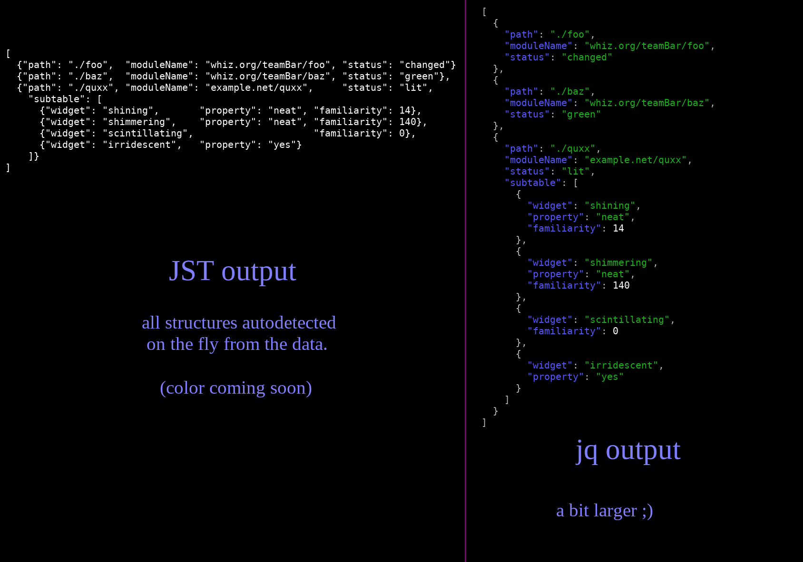

go-jst
======

JST -- short for ***JS***ON ***T***ables -- is a json formatter that produces tabular data, aligned for pretty printing and pleasant reading.

JST is plain ol' json, and leans in on the non-semantic whitespace to produce aligned, columnar output.
These table-like views of data are human-friendly, and easy to skim.
(If you've used `column -t` before in the shell: it's like that, but structurally aware of JSON.)

JST output still parses as completely regular json, with any unmodified off-the-shelf json parser.

JST can be fed any json data as input, and will use [heuristics](docs/structure-detection.md) to "do the right thing" and present it well.

Let's see it!
-------------

This picture is a side-by-side comparison with [`jq`](https://stedolan.github.io/jq/) output:

A table-like format means much more information can fit into the same two-dimensional space.
The columnar layout makes it easier to compare the same field across multiple objects.

(`jq` is of course _freakin awesome_.  I consider it an inspiration.
But this visualization shows nicely how prioritizing compactness and alignment can produce a very different feel.)

How does it work?
-----------------

By default, JST is based entirely on shameless (but effective) heuristics.  It's also configurable.

(Okay, it *will* be configurable.  This is a hobby project -- it does what I need it to do, when I need it.  "PRs welcome.")

You can read more about the heuristics in [docs/structure-detection](docs/structure-detection.md).

You can read more about the configuration mechanisms in [docs/configuration](docs/configuration.md).

It's really just JSON.
----------------------

You can pipe JST output straight to any other program that processes JSON data.
You can pipe JST output into [`jq`](https://stedolan.github.io/jq/), for example!

(If using JST in [colorized](docs/colors.md) mode, you might need to filter the color codes back out.)

Are there caveats?
------------------

Of course!

Given that JST is "it's just json", we have limits: we can't be like a spreedsheet that truncates the rendering of a cell, but expands on click, etc; we just don't have those options.
In general the JST formatter is making a best effort, and is designed to play nice if it's fed data that's playing (reasonably) nice.
It's definitely not guaranteed to do a perfect thing for all data with zero configuration; I don't think that's even possible.

JST doesn't try to format things nicely in the face of arbitrary input.
At some point you'll have to configure things if the heuristics don't work for you.

If someone puts in a 400-character long string, JST will still align a whole column to that (not truncate it).

JST sort of generally assumes you have infinite horizontal screen space.
If you don't have enough room to fit the data, it probably won't look nice anymore --
this depends a lot on how your terminal handles soft wrapping (or if it's clever enough to scroll).
There's only so much that can be done when we're doing plain text presentation and you've got more data than the screen can hold.
(There's also support for kicking some "columns" to their own line (like sub-tables automatically do), but it requires configuration.)

JST is meant for being pretty, not maximizing throughput.  It also can't stream.
(You can't *do* columnar layout until you've seen how big all the columns have to be,
which inherently requires two passes over the data: one to find the sizes, and another to do the aligned printing.)

Overall, I'd consider using this on things like formatting (config files, or test fixture data files, etc); or rapid prototyping UI; things like that.
Be judicious about putting it in a situation that's going to handle totally unbounded user input.

Known Bugs
----------

The size-computing functions used for computing column alignment don't correctly handle multi-byte characters, nor graphemes.
They will generally over-estimate the size of these things, which causes too little spacing to be added during aligned printing.

See also [caveats](#are-there-caveats) for things that aren't bugs, but are still limitations you probably want to know about.

License
-------

SPDX-License-Identifier: Apache-2.0 OR MIT
